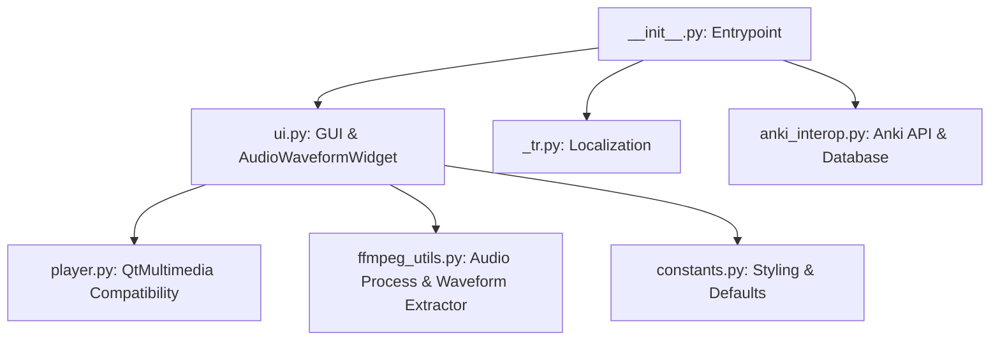

# Architecture of Audio Card Cutter (AnkiVN)

This document provides a high-level technical overview of the `audio_cutter` Anki add-on architecture, its modules, custom widgets, threading model, and implementation details.

---

## 🗺️ Architectural Overview

The add-on is structured using modular design principles, adhering to the Single Responsibility Principle (SRP). The previous monolithic implementation has been refactored into focused modules:



### Module Descriptions

1. **`__init__.py`**
   - **Role**: Lightweight entry point and bootstrapper.
   - **Responsibility**: Registers menu actions in Anki's top menubar (`AnkiVN` -> `Audio Card Cutter`), binds keyboard shortcuts (`Ctrl+Shift+A`), and instantiates `AudioCutterDialog` safely without duplicating visible instances.

2. **`ui.py`**
   - **Role**: Main UI and Interaction Controller.
   - **Responsibility**: Implements `AudioCutterDialog` (inheriting `QDialog`). Configures widgets (file selector, deck/notetype pickers, text fields, tags, speed modifiers) and hooks up key/mouse shortcuts. Integrates the custom `AudioWaveformWidget`.

3. **`player.py`**
   - **Role**: QtMultimedia Compatibility Layer.
   - **Responsibility**: Abstracts differences between Qt5 and Qt6 multimedia systems. 
     - *Qt6*: Imports `QMediaPlayer` and `QAudioOutput`.
     - *Qt5*: Falls back to importing `QMediaPlayer` and `QMediaContent`.

4. **`ffmpeg_utils.py`**
   - **Role**: Audio Extraction and Manipulation Engine.
   - **Responsibility**: Locates or downloads FFmpeg/FFprobe binaries, executes cuts of audio segments into `collection.media`, and reads PCM stream data to compute the audio waveform profile.

5. **`anki_interop.py`**
   - **Role**: Anki Backend Integration.
   - **Responsibility**: Reads/writes add-on configuration, creates notes in target decks using specific note types, and maps audio files into note fields. Interfaces with Anki's transaction log for native undo support.

6. **`constants.py`**
   - **Role**: Centralized Constants & Configurations.
   - **Responsibility**: Holds UI stylesheets, default settings, timing factors, playback speeds, and styling colors.

7. **`_tr.py`**
   - **Role**: Localization (i18n).
   - **Responsibility**: Resolves and returns localized text strings based on Anki's primary language setting.

---

## ⚡ Technical Highlights

### 1. Zero-Lag Waveform Extractor
Extracting audio data from huge files (e.g. 1-hour audiobooks) can freeze the main thread. To prevent this:
* **Background Threading**: When an audio file is loaded, `ui.py` delegates extraction to a background worker using Anki's native `mw.taskman.run_in_background()`.
* **Efficient Streaming**: FFmpeg is invoked in a subprocess to resample the audio to a low sample rate (default `100Hz`, mono) and output raw 32-bit floats directly to stdout:
  ```bash
  ffmpeg -i [src] -ac 1 -filter:a aresample=100 -f f32le -
  ```
* **Memory Unpacking**: Python reads the stdout stream and unpacks raw bytes directly using `struct.unpack(f"{num_floats}f", stdout)`.
* **Normalization**: The floats are converted to absolute amplitudes, scaled to `[0.0, 1.0]`, and returned to the main UI thread via a callback to update the waveform widget.

### 2. Custom `AudioWaveformWidget` (PyQt Widget)
Instead of a standard slider, a custom widget `AudioWaveformWidget` (inheriting `QAbstractSlider`) is implemented:
* **Custom Painting**: Implements `paintEvent(QPaintEvent)` using `QPainter`. Draws the background waveform representation as vertical bars dynamically styled according to the Anki theme (dark/light mode friendly).
* **Interactive Range Selection (Audacity-like)**:
  * **Hover/Click**: Clicking anywhere positions the playhead (seek).
  * **Drag Selection**: Clicking and dragging highlights a selection region (marked by a semi-transparent blue overlay).
  * **Callbacks**: Releasing the mouse automatically emits the selected `Start` and `End` time ranges to the text fields.
* **Syncing Playhead**: Binds to `QMediaPlayer.positionChanged` to update the red vertical playhead line in real-time.

### 3. Native Anki Undo Integration
To avoid breaking the user's undo stack or corrupting database transactions:
* Before adding a card, a checkpoint is saved via `mw.checkpoint("Add Audio Note")`.
* If the user clicks **Undo**, the add-on invokes `mw.col.undo()`, which reverses the database insertion, and deletes the generated physical audio file from the media collection.

---

## 🛠️ Developer guidelines

### Setup & Testing
To debug and run the add-on in a standalone environment without loading the full Anki application:
1. Mocking is provided in scratch scripts to run test suits.
2. The folder structure follows Anki's standard 2.1 addon format:
   - Root directory contains `manifest.json`, `meta.json`, `config.json`.
   - `bin/` directory contains platform-specific `ffmpeg.exe` and `ffprobe.exe` (which can be downloaded via the UI on Windows).

### Style Compliance
* Adhere to **PEP 8** style guidelines.
* Keep imports dynamic or conditional for compatibility across different Anki releases (which ship with PyQt5 or PyQt6).
